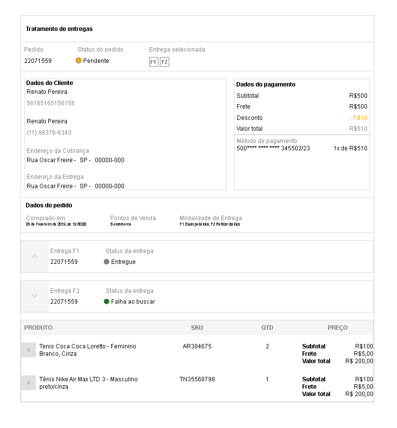

baseado no challenge da chaordic 

ferramentas react, typescript  

o projeto consiste em exibir o produto com base na api, se clicar no segundo botão inferior exibi os produtos selecionados, ao clicar novamente fecha

